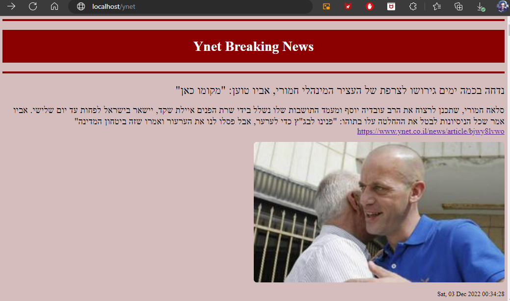

# *Kubernetes-Ynet-Bitcoin*


 
 ## *Kubernetes Projects that shows price of BitCoin and displays the latest news from Ynet:* 
 
> 1- *Presents the Current BitCoin Price, And the Average Price for the last 10 minutes and stores the price in a Redis Database.*  

> 2- *Reads the “Breaking News” from YNet news service.* 
 

## Run With Minikube:

Clone the project

```bash
  git clone https://github.com/RashedKewan/Kubernetes-Summary-Task.git
```

Go to the project directory

Start minikube

```bash
  minikube start
```

Enable ingress addon

```bash
  minikube addons enable ingress
```
Apply Deployment

```bash
  kubectl apply -f .
```

Start minikube tunnel

```bash
  minikube tunnel
```

Access from browser:  

- http://localhost/bitcoin


- http://localhost/ynet 


## Services:


## Pods:


## Ingress:


## Run the apps with Docker

Run BitCoin image from DockerHub

```bash
  docker pull kewanrashed/bitcoin_price
  docker run -d -p 5000:5000 salehtaha/docker-final-task:1.1
```


  
Run Ynet image from DockerHub

```bash
  docker pull kewanrashed/ynetnews
  docker run -d -p 5000:5000 salehtaha/ynet-news:latest
```


